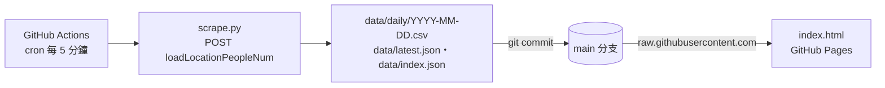

# TPSC Monitor（臺北市運動中心 即時人流監測）

**即時頁面：https://starz333.github.io/tpsc-monitor/**

每 5 分鐘（GitHub Actions cron 排程，實際間隔視 GitHub 負載而定，通常 1〜3 小時）抓取
「[臺北市運動中心預約系統](https://booking-tpsc.sporetrofit.com/Home/LocationPeopleNum)」
全市 12 座運動中心的**游泳池**與**健身房**即時人數，累積成歷史資料，
並以 GitHub Pages 提供圖表頁：即時狀態卡、全市總覽、任一日期的人數／佔用率走勢。

## 運作方式



- 爬蟲不使用瀏覽器：預約系統頁面本身就是每秒輪詢 JSON 端點
  `POST /Home/loadLocationPeopleNum`，`scrape.py` 直接呼叫同一端點（requests，約 15 秒跑完）。
- 前端只抓所選日期的小檔案（每日約 20〜160 KB）與 `latest.json`（約 2 KB），
  每分鐘自動檢查更新；不再需要下載整包歷史資料。
- 頁面部署（`pages.yml`）與資料提交解耦：資料更新不觸發部署，只有 `index.html`
  等頁面檔案變動才重新部署。

## 資料佈局

```
data/
├── daily/YYYY-MM-DD.csv   # 每日一檔，欄位：timestamp,code,name,area,current,capacity,occupancy_pct
├── latest.json            # 最新一次抓取快照（前端輪詢用）
└── index.json             # 有資料的日期清單（日期選擇器定界用）
```

- `area` 為「游泳池」或「健身房」；`capacity` 為 0 表示該設施未開放（例如尚未啟用的南港）。
- 時間戳為台北時區（+08:00）ISO 8601；2026-07 之前的舊資料帶微秒，之後為秒級精度。

## 本地開發

```bash
pip install -r requirements.txt
python scrape.py                 # 抓一次即時資料寫入 data/
python -m http.server 8000       # 前端在本地會自動改讀 ./data
# 開啟 http://localhost:8000
```

## 部署設定（一次性）

Settings → Pages → Build and deployment → **Source 選「GitHub Actions」**。

倉庫早期使用「Deploy from a branch」模式，該模式會對**每一次資料提交**都執行一次內建
Jekyll 建置（歷史上已累計上萬次）。切換後改由 `.github/workflows/pages.yml` 部署，
只在頁面檔案變動時執行。未切換前一切功能照常，只是持續浪費建置額度。

## 維運備註

- **舊資料自動遷移**：若 `data/all_people.csv`（舊的單一累積檔）存在，
  每次抓取前 `scripts/migrate_split_csv.py --delete-source` 會把缺漏列補進
  `data/daily/` 後將其刪除；平時此步驟為 no-op。
- **抓取失敗**：自動重試 3 次；仍失敗時回應會轉儲到 `debug/` 並上傳為
  workflow 工件（保留 3 天），該次不寫入任何資料，前端以「最後更新」時間顯示延遲。
- **後備爬蟲**：若 JSON 端點失效（網站改版），可人工執行
  `scripts/legacy_playwright_scraper.py`（Playwright 無頭瀏覽器版，需另行安裝依賴，
  見該檔案開頭說明）。
- **排程停用提醒**：GitHub 對 60 天無活動的倉庫會自動停用 cron。正常情況下爬蟲自身的
  資料提交即為活動；但若抓取連續失敗超過 60 天，排程會靜默停用，需手動重新啟用。
